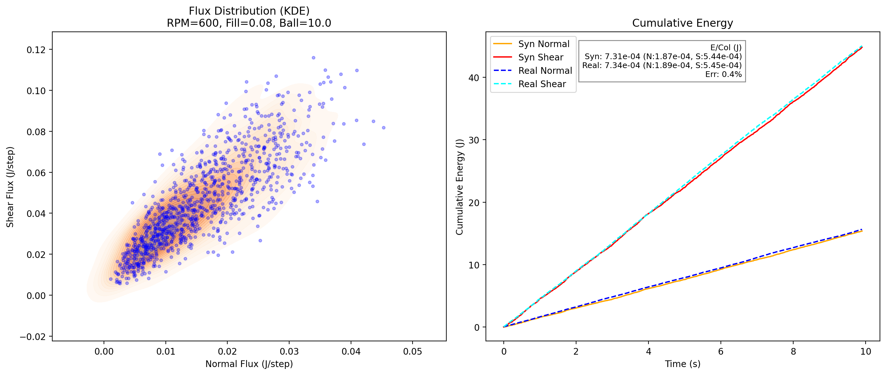

# Generative Physics Surrogate V2: Collision Frequency & Energy Flux




This repository contains the V2 implementation of a **Conditional Flow Matching (CFM)** surrogate model for granular mechanics.

It predicts the joint distribution of:
1.  **Normal Energy Flux** (Impact)
2.  **Shear Energy Flux** (Friction)
3.  **Collision Frequency** (Contacts per timestep)

This allows the model to derive the physical metrics: **Average Energy per Collision ($E_{col}$)** due to shearing and compression, which are crucial for mechanochemical reaction kinetics. Furthermore, it's possible to vary rpm, ball size, and fill ratio.

## 📂 Structure

- `cfm_data_extraction_v2.py`: Extracts Energy + Collision counts from EDEM `.dem` files.
- `cfm_dataset_v2.py`: Preprocesses data, applies log-transform to all 3 targets.
- `cfm_model_v2.py`: 3D Output Vector Field Network (ResNet).
- `train_cfm_v2.py`: OT-CFM Training loop.
- `inference_cfm_v2.py`: Static validation plots with $E_{col}$ metrics.
- `interpolate_video_v2.py`: Generates the "Interpolation Sweep" video with real-time physics metrics.

## How to Run

### 1. Data Extraction
Point the script to your root folder containing `.dem` simulations.
```bash
python3 cfm_data_extraction_v2.py --root "/path/to/simulations" --output "extracted_energy_data_v2.pkl"
```

### 2. Training
Train the Flow Matching model or use the pre-trained model.
```bash
python3 train_cfm_v2.py --data "extracted_energy_data_v2.pkl" --epochs 1000
```

### 3. Inference & Validation
Generate static plots comparing AI predictions to Ground Truth, including the Energy/Collision breakdown.
```bash
python3 inference_cfm_v2.py --checkpoint "cfm_checkpoints_v2/best_model_v2.pth" --rpm 600 --fill 0.2
```

### 4. Generate Video
Create the interpolation video that sweeps through Fill Ratios, overlaying Real Data when available.
```bash
python3 interpolate_video_v2.py --checkpoint "cfm_checkpoints_v2/best_model_v2.pth" --rpm 600 --ball 10.0
```

## 🧠 Model Details
- **Architecture:** ResNet-based Vector Field (8 layers, 512 hidden dim).
- **Time Embedding:** Sinusoidal.
- **Loss:** Conditional Flow Matching (MSE between predicted velocity and optimal transport path).
- **Target:** 3D Vector `[log(Flux_N), log(Flux_S), log(Collisions)]` (Normal (compression), tangential (shear), collision rate).

## 🔬 Physics Metrics
The model calculates the average energy per collision as

$$
E_{\text{col}} = \frac{\sum \text{Flux (W)}}{\sum \text{Collision Rate (Hz)}}
$$

This is further split into normal ($E_{n,\text{col}}$) and shear ($E_{s,\text{col}}$) components to analyze the dissipation mode.


